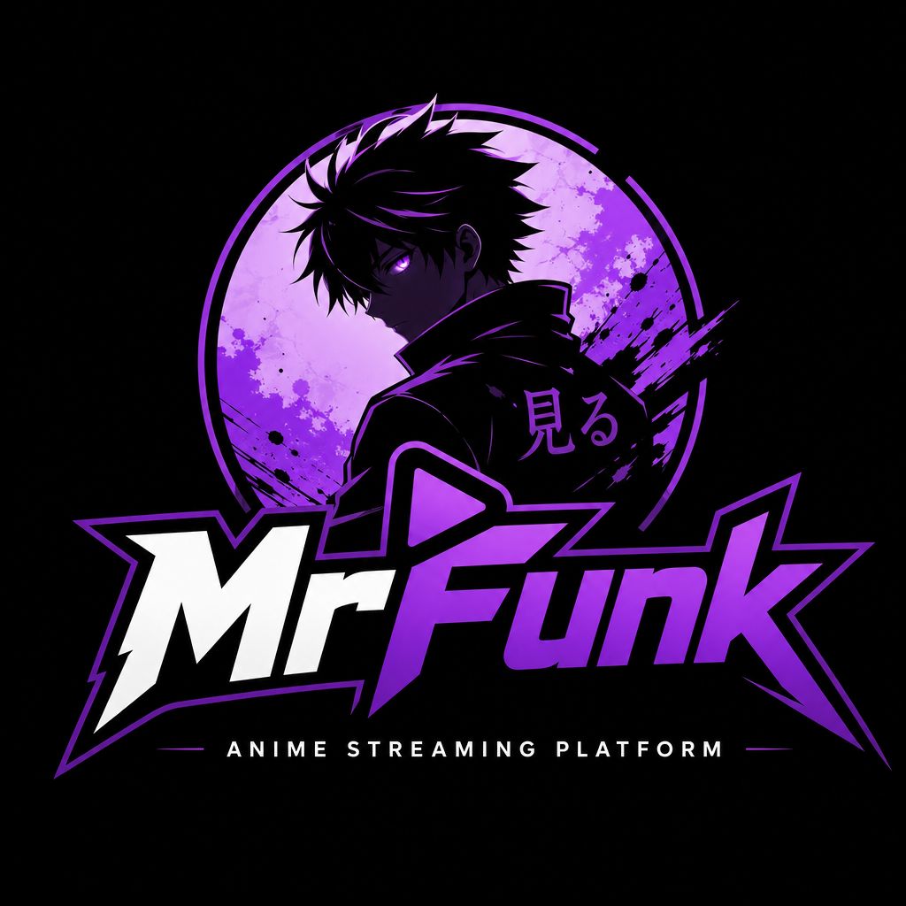

<div align="center">
  
  <h1>MrFunk</h1>
  <p><b>Nonton anime & donghua sub Indo — satu tempat, semua provider.</b></p>

  
  
  
  
  [](https://teer.id/anrizz)

  <br/>
  <a href="https://kenkazumi.biz.id"><b>🌐 Live Site</b></a> &nbsp;·&nbsp;
  <a href="https://teer.id/anrizz"><b>☕ Trakteer</b></a> &nbsp;·&nbsp;
  <a href="https://github.com/aldirahmanhh/Funknime/issues"><b>🐛 Report Bug</b></a>
</div>

---

## Apa ini?

MrFunk ngambil data dari beberapa provider anime (Otakudesu, Samehadaku, dll) lewat satu API, terus nampilin semuanya di satu website yang enak dipake. Jadi ga perlu buka banyak situs buat nyari anime.

Fitur utamanya:
- **Multi-provider** — otomatis fallback kalau satu server mati
- **Donghua** — bukan cuma anime, donghua juga ada
- **Lanjut nonton** — nyimpen progress sampai menit & detik terakhir
- **Tanpa login** — langsung pake, ga ribet

## Screenshot

> _coming soon_

## Tech

| | |
|---|---|
| Frontend | React 19 + Vite 8 |
| Routing | React Router v7 |
| Hosting | Vercel (serverless) |
| Data | [Sankavollerei API](https://www.sankavollerei.com) |
| Donasi | [Trakteer API](https://trakteer.id) |

## Jalanin di lokal

```bash
git clone https://github.com/aldirahmanhh/Funknime.git
cd Funknime
npm install
npm run dev
```

Build production:
```bash
npm run build
```

## Struktur

```
src/
├── components/    # semua halaman & komponen
├── contexts/      # theme context
├── hooks/         # useDebounce, useInfiniteScroll
├── services/      # api.js (fetch + cache + rate limit)
├── utils/         # watch history (localStorage)
└── main.jsx       # entry point
```

## Fitur lengkap

- 🔍 Search gabungan (Otakudesu + Samehadaku)
- 📺 Streaming multi-server dengan quality selector
- 🐉 Donghua (ongoing, completed, genre, A-Z)
- 📅 Jadwal tayang harian
- 🎭 Browse genre dari 2 provider
- 🔤 Daftar A-Z (anime & donghua)
- 🕐 Watch history + resume dari menit terakhir
- ☕ Trakteer donasi + leaderboard top donatur
- 🛡️ Anti-ads bawaan buat iframe streaming
- 📱 Responsive (mobile, tablet, desktop)
- 🎨 Dark theme + purple neobrutalism UI

## Credits

- **API** — [Sankavollerei](https://www.sankavollerei.com) (gratis, rate limit 50 req/min)
- **Donasi** — [Trakteer](https://teer.id/anrizz)
- **Icons** — Emoji native

## Dukung project ini

MrFunk itu gratis & open source. Kalau kamu suka dan mau bantu biaya server + domain:

[](https://teer.id/anrizz)

Atau cukup kasih ⭐ di repo ini — itu juga udah bantu banget.

## Disclaimer

Project ini dibuat buat belajar. Semua konten anime disediakan oleh pihak ketiga, MrFunk ga nyimpen file video apapun.

---

<div align="center">
  <sub>Made with 💜 by <a href="https://github.com/aldirahmanhh">aldirahmanhh</a></sub>
</div>
